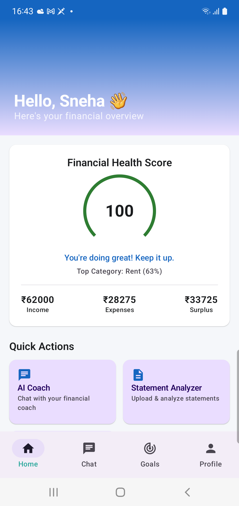
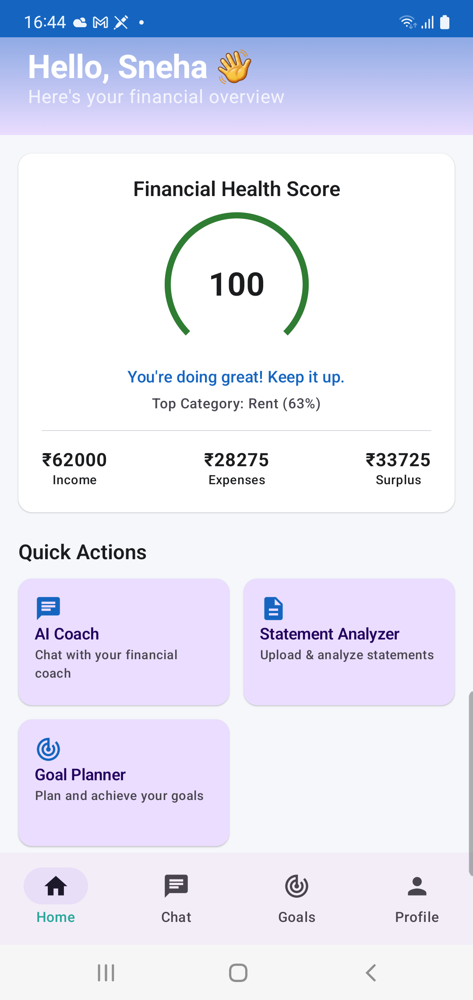
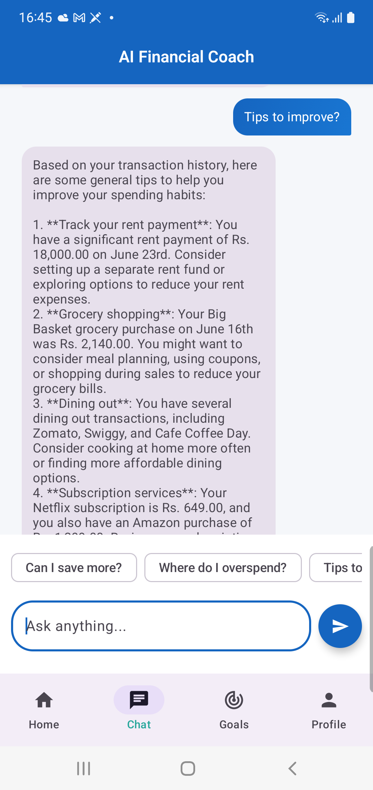
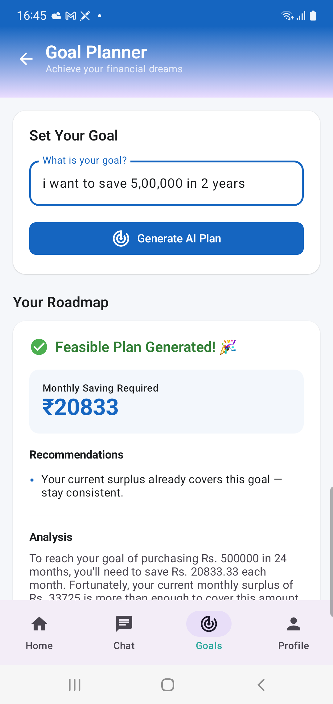
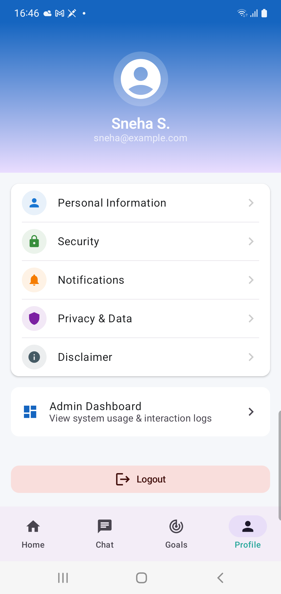
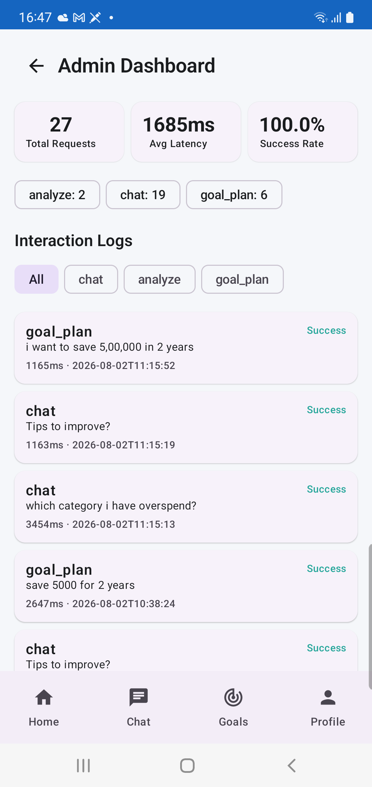

# FinPilot AI

**Your AI Financial Coach** — an Android-native financial coaching app combining RAG, a LangGraph agentic Goal Planner, safety guardrails, and Kotlin Multiplatform architecture.

---

## Overview

FinPilot AI lets a user upload a bank/card statement PDF, then:
- **Ask questions** about their spending and get grounded, cited answers (RAG)
- **See a deterministic Financial Health Score** computed from real transaction data — never AI-generated numbers
- **Generate savings goal plans** via a multi-step, self-correcting LangGraph agent
- **View system usage** through an admin/audit dashboard (second-persona ops surface)

Built as a capstone project demonstrating retrieval-augmented generation, agentic orchestration, AI safety guardrails, evaluation methodology, and Kotlin Multiplatform mobile architecture.

---

## Screenshots

| Home Dashboard | Quick Actions |
|---|---|
|  |  |
| Financial Health Score gauge, income/expense/surplus, top spending category — all computed deterministically from the uploaded statement. | Direct access to AI Coach, Statement Analyzer, and Goal Planner. |

| AI Coach (Chat) | Goal Planner |
|---|---|
|  |  |
| Multi-turn conversational RAG with quick-reply chips; answers grounded in the user's real transaction data. | LangGraph agent output: feasibility check, required monthly saving, and a narrative explanation — see [Goal Planner Agent](#goal-planner-agent-the-agentic-core) below. |

| Profile (with Admin entry point) | Admin Dashboard |
|---|---|
|  |  |
| Second-persona entry point — Admin Dashboard is reachable from Profile, kept separate from the primary user flow. | Live usage metrics (total requests, avg latency, success rate) and a filterable interaction log across chat/analyze/goal_plan. |

> To use these images: save your app screenshots into `docs/screenshots/` in the repo with the filenames referenced above (or update the paths to match your own naming).

---

## Architecture

```
Android App (Kotlin Multiplatform + Jetpack Compose)
        |  HTTPS / JSON (Ktor client)
        v
FastAPI Backend (Python)
  |-- Auth (JWT + bcrypt + SQLite)
  |-- PDF Extraction -> Chunking -> Embedding -> Qdrant (vector DB)
  |-- Retrieval -> LLM (Groq) -> Guardrails -> Response
  |-- LangGraph Agent (Goal Planner) -> Deterministic math + LLM narrative
  |-- Deterministic Financial Summary (health score, category breakdown)
  \-- Audit Logging -> Admin Dashboard (usage metrics, interaction logs)
```

---

## Backend

**Stack:** FastAPI · LangChain / LangGraph · Qdrant · FastEmbed · Groq (Llama 3.1) · SQLAlchemy · SQLite · bcrypt · JWT

### Core Components

| Component | What It Does |
|---|---|
| `pdf_extraction.py` | Extracts text/tables from statement PDFs (pdfplumber) |
| `chunking.py` | Transaction-aware chunking — groups consecutive transaction lines rather than splitting on a fixed character count |
| `embedding.py` | Embeds chunks (FastEmbed, local) and stores them in Qdrant with idempotent upsert |
| `retrieval.py` | Semantic top-k search + full unranked retrieval for financial calculations |
| `llm.py` | Single choke-point for all Groq calls — RAG answers, multi-turn chat, structured goal extraction, plan narratives |
| `financial_summary.py` | **Deterministic** (non-LLM) computation of health score, savings rate, category breakdown |
| `guardrails.py` | Three safety checks: numeric consistency, advice-boundary, context-sufficiency |
| `audit.py` | Logs every AI interaction (type, request/response summary, latency, success) for the admin dashboard |

### Goal Planner Agent (the agentic core)

A LangGraph `StateGraph` with 6 nodes and a **conditional retry edge**:

```
classify_goal -> retrieve_context -> generate_plan -> validate_plan
                                           ^                |
                                           |   (infeasible, retries left)
                                           +---- extend_timeline <----+
                                                                      |
                                      (feasible, OR retries exhausted)|
                                                      v
                                                format_result -> END
```

- **classify_goal** — LLM extracts structured goal type/amount/timeline from free text
- **retrieve_context** — pulls the user's real income/expense data (the agent's "tool use" step)
- **generate_plan** — required saving computed with plain Python math (never LLM-generated); one LLM call only for the narrative
- **validate_plan** — the guardrail node; checks whether the plan actually closes the numeric gap
- **extend_timeline** — self-correction: recalculates a workable timeline (capped per goal type) and loops back
- **format_result** — shapes the final response with a derived confidence level

This conditional branching — the graph inspecting its own output and deciding what to do next — is what makes this an **agent**, not a single-prompt RAG chain.

### API Endpoints

| Method | Endpoint | Purpose |
|---|---|---|
| GET | `/health` | Liveness check |
| POST | `/auth/signup`, `/auth/login` | Username/password auth, returns JWT |
| POST | `/upload` | Upload + extract + chunk + embed a statement PDF |
| POST | `/analyze` | RAG Q&A scoped to one statement |
| POST | `/chat` | Multi-turn AI Coach conversation |
| GET | `/chat/summary` | Deterministic financial health summary |
| POST | `/goal-plan` | Runs the LangGraph Goal Planner agent |
| GET | `/admin/logs` | Filterable interaction log (paginated) |
| GET | `/admin/metrics` | Usage metrics: totals, avg latency, success rate, 7-day trend |

### Setup

```bash
cd finpilot-backend
python -m venv venv
venv\Scripts\activate        # Windows
pip install -r requirements.txt

# .env file:
# GROQ_API_KEY=your_key_here
# JWT_SECRET_KEY=your_random_secret

uvicorn app.main:app --reload --host 0.0.0.0 --port 8000
```

---

## Android App (Kotlin Multiplatform)

**Stack:** Kotlin Multiplatform · Jetpack Compose · Material3 · Ktor · kotlinx.serialization · Coroutines/StateFlow

### Architecture

- **`shared/`** — platform-agnostic business logic (models, networking, ViewModels), usable by any KMP target
- **`androidApp/`** — Jetpack Compose UI only, Android-specific

The KMP boundary uses `expect`/`actual`: `commonMain` declares `expect fun createHttpClient(): HttpClient`, `androidMain` provides the OkHttp-based `actual` implementation. Adding an iOS target later would only need a new `actual` — zero changes anywhere else.

### Screens

| Screen | Key Features |
|---|---|
| Login/Signup | Username/password auth against `/auth/*`, toggles between modes |
| Home Dashboard | Custom Canvas-drawn health score gauge, income/expense/surplus, Quick Actions grid |
| AI Coach (Chat) | Multi-turn conversation, quick-reply chips, source citations |
| Statement Analyzer | PDF upload + inline Q&A with citation chunk pills |
| Goal Planner | Goal input form → agent-generated plan with feasibility, recommendations, narrative |
| Profile | User info, monthly income input (overrides unreliable statement-parsed income), settings, **Admin Dashboard entry point** |
| Admin Dashboard | Usage metrics + filterable interaction logs — the second-persona ops surface |

### State Management

Every screen has a shared `ViewModel` (plain Kotlin class, not `androidx.lifecycle.ViewModel`, to stay KMP-shareable) exposing a `StateFlow<UiState<T>>`, where `UiState` is a sealed class (`Loading` / `Success` / `Error`) standardizing async state across the whole app.

### Setup

1. Open in Android Studio.
2. Point `FinPilotApi`'s `baseUrl` at:
   - `http://10.0.2.2:8000` (emulator)
   - `http://<your-LAN-IP>:8000` (physical device — also update `network_security_config.xml`)
   - your deployed Cloud Run URL (production)
3. Run on emulator or device.

---

## AI Safety Guardrails

| Guardrail | What It Catches |
|---|---|
| **Numeric consistency** | Flags any number in an LLM response that doesn't appear in the source data it was given — prevents hallucinated figures |
| **Advice-boundary** | Detects product-recommendation phrasing ("invest in the X fund") and substitutes a safe disclaimer |
| **Context sufficiency** | Refuses to answer (before calling the LLM) when no relevant data was retrieved |

All three are applied to `/chat`, `/analyze`, and the Goal Planner agent's narrative generation — every LLM touchpoint, not just one.

---

## Evaluation

`eval_suite.py` runs 12 categorized prompts against the live backend:
- **Retrieval Accuracy** (3) — automated
- **Routing** (3) — automated, tests `classify_goal`'s intent classification
- **Safety/Guardrails** (3) — automated
- **Response Quality** (3) — mixed automated + human-judged

```bash
python eval_suite.py
```

---

## Known Issues & Scope Cuts

- JWT tokens are issued but not yet enforced on `/chat`, `/analyze`, `/goal-plan`
- Session state (auth token, income override) is in-memory only — lost on app restart
- Income detection from statement text is inherently unreliable (a statement shows balance, not salary) — addressed via an explicit user-entered income field in Profile

---

## Concepts Demonstrated

RAG · Vector Search (Qdrant) · Embeddings (FastEmbed) · LangGraph Agentic Orchestration · Conditional State Machines · Self-Correction Loops · AI Safety Guardrails · Prompt Engineering · Evaluation Methodology · Deterministic/Generative Separation · REST API Design · JWT Auth · ORM · Kotlin Multiplatform · MVVM · Reactive State (StateFlow) · Declarative UI (Compose)
